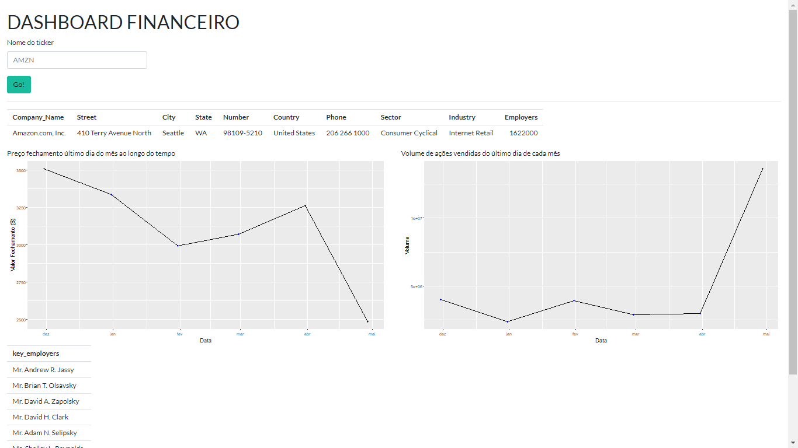

## Desafio LaraIA Tech

O projeto consiste no scraping de dados e criação de dashboard a partir de tickers de empresas do Yahoo Finance.

O código foi desenvolvido em **R** e consiste em um arquivo com funções para coleta e tratamento dos dados utilizando as libs  **rvest** para scraping dos dados sobre a empresa no yahoo finance, **tidyquant** para os dados de série temporal dos tickers e para finalizar o uso da **shiny** para criação do dashboard.  

**Descrição dos arquivos:**
 - **handle_data.R**: Coleta e trada os dados.
 - **Shiny.R**: Cria dashboard.

**Como utilizar?**  

Primeiro é preciso instalar o R e o RStudio em :https://livro.curso-r.com/1-1-instalacao-do-r.htmlhttps://livro.curso-r.com/1-1-instalacao-do-r.html
Após a instalção do R é preciso instalar as libs:
``install.packages("rvest")``  
``install.packages("lubridate")``    
``install.packages("quantmod")``  
``install.packages("tidyquant") ``  
``install.packages("shiny")``  
Então é só executar o arquivo Shiny.R ``Ctrl + Shift + Enter``

